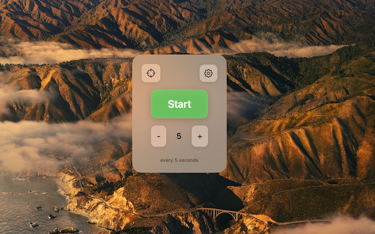
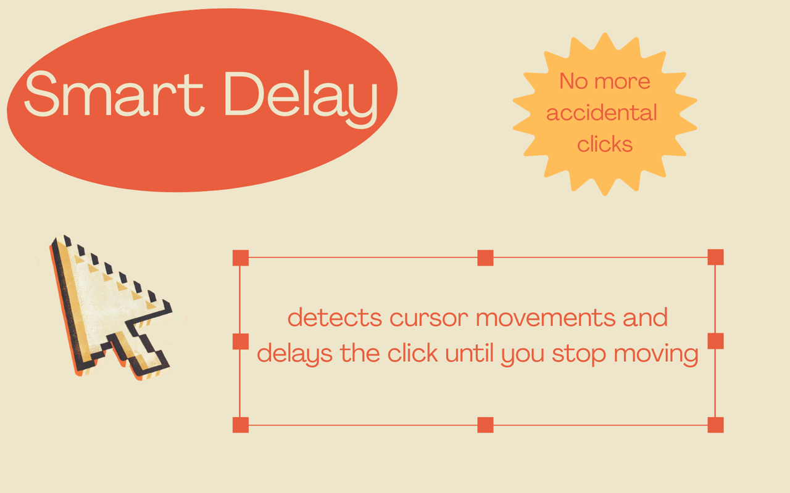
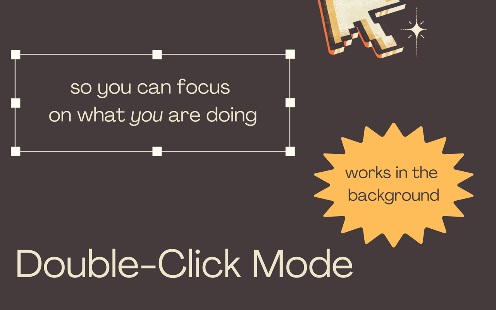

# AutoClicker

A lightweight macOS auto-clicker that lets you pick an exact on-screen target and click it repeatedly at a configurable rate. Runs as a menu bar utility with a simple "set target → start → stop" workflow.

## How to Download

**[Download AutoClicker.zip](AutoClicker.zip)**

> **⚠️ Important:** This app takes control of your cursor to perform automated clicks.
>  
> use **Control + Option + Command + Q** to stop the clicker at anytime.
>  
>  

## How to Use

1. **Launch** the app.
2. **Set target:** Click the target (scope) button, then click anywhere on your screen where you want the auto-clicker to click.
3. **Adjust speed:** Use the + and - buttons to edit the click rate.
4. **Start:** Press the Start button. The app will click your target location at the set rate.
5. **Stop:** Press Stop, or use the emergency hotkey **⌃⌥⌘Q** (Control-Option-Command-Q) anytime.
    
    

## Settings

Open the gear icon for:

- **Smart Delay** (waits for mouse to be idle before clicking)
- **Double Click** mode (brings your window back into focus)
- **Click Limit** (stop after a set number of clicks)
   
   

## Requirements

- **macOS 15.2** or later

## Permissions

The app needs **Accessibility** access to simulate mouse clicks. When you first start clicking, macOS will prompt you. If needed, go to **System Settings** → **Privacy & Security** → **Accessibility** and enable AutoClicker.

